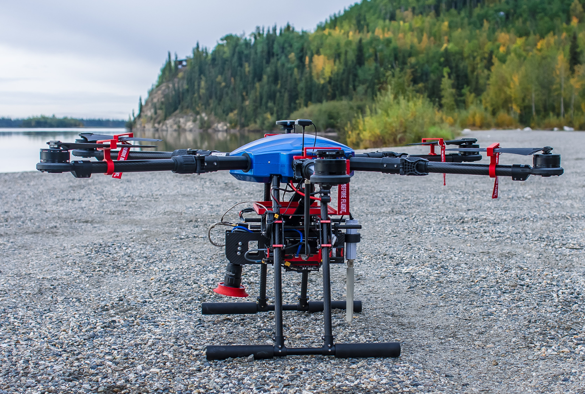

# About the ADAPT Project
{: style="width:240px;align:right"} {: style="height:240px;align:left" }

**A**utonomous **D**ata **A**cquisition and **P**rocessing **T**echnologies

The ADAPT multi-mission payload is an open-source project started by [Kitware Inc.](https://www.kitware.com/), in collaboration with [ACUASI](https://acuasi.alaska.edu/). The ADAPT payload was conceived as the on-board data collection and processing counterpart to the desktop and web-based processing capabilities of [VIAME](https://www.viametoolkit.org/). VIAME is an open-source toolkit developed by Kitware placing tools for image and video annotation and deep-learning-based training into the hands of domain experts, such as biologists, ecologists, and meteorologists, without requiring a computer science or machine learning background. Full integration of ADAPT with VIAME provides researchers with a consistent ecosystem of tools spanning the entire life cycle of their data, allowing quicker deployment of more-complete data products for their customers. For more details on how VIAME-ADAPT integration can add value to NOAA missions, see these [case studies](missions.md).

# Funding

Content on this site was prepared by Kitware Inc. using Federal funds under award NA20OAR0210083 from the National Oceanic and Atmospheric Administration, U.S. Department of Commerce. The statements, findings, conclusions, and recommendations are those of the author(s) and do not necessarily reflect the views of the National Oceanic and Atmospheric Administration or the U.S. Department of Commerce.

# Project Objectives
The objective of the ADAPT project is to develop a lightweight, low-power sUAS payload to provide on-board, real-time, deep-learning-based computer vision processing to autonomously distill down high-volume data into compact analytics that can be immediately transmitted to decision makers. Further objectives of the ADAPT payload include:

* Autonomous data adjudication and sensor control (e.g., visible and infrared cameras, navigation sensors) for optimized data collection during beyond-line-of-sight missions
* Automatic geo-registration of results leveraging navigation-sensor data and computer vision processing
* Curation of collected data for rapid and streamlined integration into [VIAME](https://www.viametoolkit.org/) for do-it-yourself deep-neural-network (DNN) training
* Real-time, on-board deployment of VIAME-trained deep neural networks for object (e.g., animal) detection and tracking as well as image segmentation (e.g., land cover mapping) with boundary vectorization for transmission over low-bandwidth down-links
* Support open science with easy-to-use, open-source software that can be deployed on low-cost, readily-available processing hardware, such as [NVIDA's Jetson](https://developer.nvidia.com/buy-jetson) edge computers