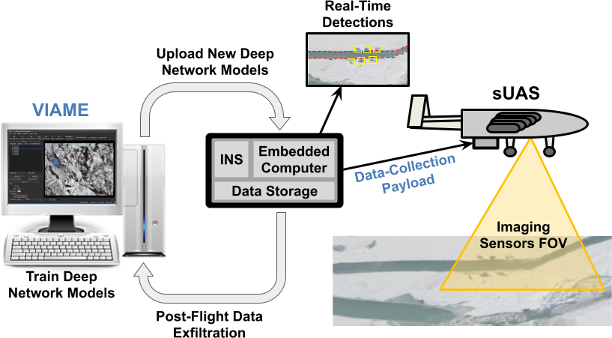

# River Ice Monitoring and Flood Prediction

With the onset of spring in Alaska, the winter snowpack melts and drains into its streams and rivers. If this snowmelt is rapid and the river ice is still mostly intact, dramatic mechanical breakup can occur, leading to downsream flooding. Such an event occured in 2013 along the Yukon River, leading to devastating floods in Galena, Alaska. High water and ice hit many villages along the river. Colossal damage left a heavy economic toll with 169 houses destroyed and an estimated $6 million needed to rebuild the public infrastructure. Historically, breakup-flood forecasting relies on manned aerial reconnaissance flights to issue timely flood watches and warnings. These flights provide observations to track river ice conditions (strength, extent, and movement) over large regions (tens to hundreds of miles) and identify ice jams.  The vast extent of Alaska, with limited ground observations, makes it difficult to provide timely and accurate forecasts. This leads to an overreliance on satellite-derived products, which are infrequently updated due to fixed observation windows limited by orbital period, low spatial resolution, and high cost. 

The ADAPT payload can be used for low-latency monitoring of changes in sea and river ice formations. Domain experts can use VIAME tools to annotate ADAPT-collected imagery to indicate the segmentation boundaries between land, ice, and water. VIAME can further be used to train a DNN semantic segmentation model that can reproduce these segmentations and classifications on yet-unseen data. The model is uploaded onto to the ADAPT payload to support in-flight extraction of dense segmentation maps of sea and river ice for each aquired image. ADAPT-system processing then distills these dense maps into a geo-registered, vectorized representations of the boundaries, which can be transmitted over a low-bandwidth downlink for real-time situational awareness for decision makers.
