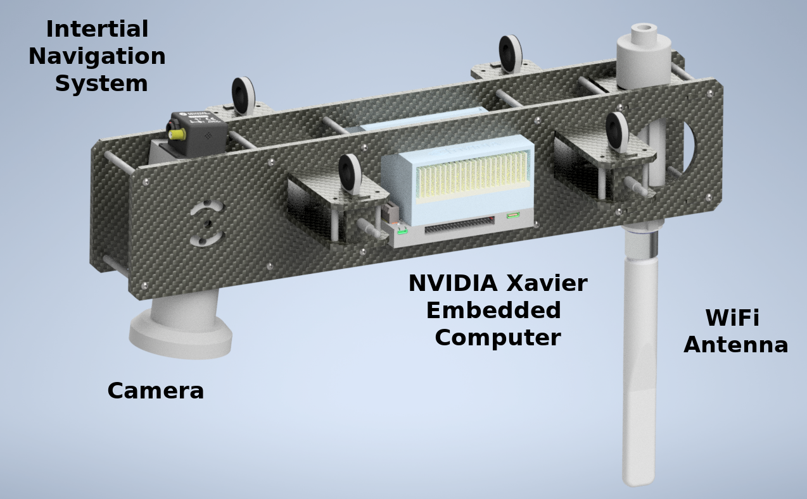

# ADAPT Multi-Mission Payload

### An open source platform for deploying state of the art deep-neural-network computer vision in real time on small unmanned aircraft systems (sUAS).

{: style="width:500px; align=right" } {: style="width:232px;align=left" }

* Optimized drone-based collection of imagery and geospatial metadata with live feedback to maintain quality control.

* Integration with the open source do-it-yourself AI toolkit [VIAME](https://www.viametoolkit.org/) to annotate data and train mission-specific image-processing models.

* Upload your models for aerial deployment with real-time, georegistered analytics wirelessly transmitted to a ground station computer and beyond for rapid dissemination.

* Commodity [hardware components](parts) and open-source software allows organizations to cheaply and easily build their own payloads

## Supports a variety of unique missions

* [Sea and River Ice Monitoring](ice_monitor.md)
* [Monitoring Arctic Mammal Populations](ice_seal.md)
* [Person Search and Rescue](search_and_rescue.md)
* [Wild Fire Monitoring](fire_monitoring.md)
* [Coastline Erosion Monitoring](coastline_monitoring.md)

Ongoing work on the ADAPT project is funded by [NOAA](https://www.noaa.gov/) to support [key missions](https://uas.noaa.gov/Portals/5/Docs/NOAA%20UAS%20Program%20Overview%2019Apr2019.pdf?ver=2019-04-22-144716-137).

## Explore
[Try the simulator with docker](https://gitlab.kitware.com/adapt/adapt/-/tree/master/AirSim){.md-button}

## Upcoming Events
We are going to Fairbanks Alaska September 6, 2021 for data collection...