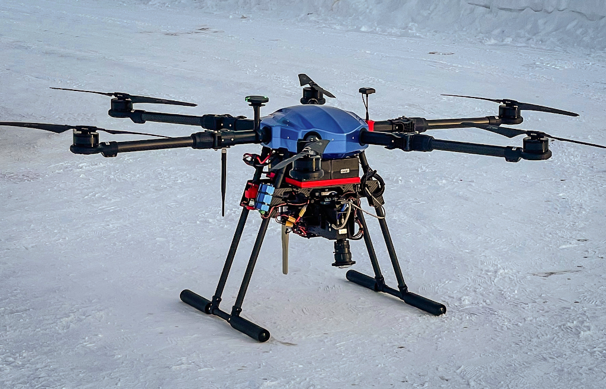

# ADAPT Multi-Mission Payload

### An open source platform for deploying state of the art deep-neural-network computer vision in real time on small unmanned aircraft systems (sUAS).

Get the source code: [https://gitlab.kitware.com/adapt/adapt_ros_ws](https://gitlab.kitware.com/adapt/adapt_ros_ws)

{: style="height:240px; align:left" } {: style="height:240px;align:right" }

* Optimized drone-based collection of imagery and geospatial metadata with live feedback to maintain quality control.

* Integration with the open source do-it-yourself AI toolkit [VIAME](https://www.viametoolkit.org/) to annotate data and train mission-specific image-processing models.

* Upload your models for aerial deployment with real-time, georegistered analytics wirelessly transmitted to a ground station computer and beyond for rapid dissemination.

* Commodity [hardware components](parts), [CAD models](https://github.com/Kitware/adapt/tree/main/cad), and [open-source software](https://gitlab.kitware.com/adapt/adapt_ros_ws) allows organizations to cheaply and easily build their own payloads

## Supports a variety of unique missions

* [Sea and River Ice Monitoring](ice_monitor.md)
* [Monitoring Arctic Mammal Populations](ice_seal.md)
* [Person Search and Rescue](search_and_rescue.md)
* [Wild Fire Monitoring](fire_monitoring.md)
* [Coastline Erosion Monitoring](coastline_monitoring.md)

Ongoing work on the ADAPT project is funded by [NOAA](https://www.noaa.gov/) to support [key missions](https://uas.noaa.gov/Portals/5/Docs/NOAA%20UAS%20Program%20Overview%2019Apr2019.pdf?ver=2019-04-22-144716-137).

## Explore
The ADAPT payload source code is hosted here: [https://gitlab.kitware.com/adapt/adapt_ros_ws](https://gitlab.kitware.com/adapt/adapt_ros_ws) or
[try the simulator with docker](https://gitlab.kitware.com/adapt/adapt/-/tree/master/AirSim)

## Events
* [Kitware and ACUASI September 2021 data collection in Fairbanks Alaska](sept_2021_collects.md).
* [The 3rd NOAA Workshop on Leveraging AI in Environmental Sciences](https://2021noaaaiworkshop.sched.com/info)

## Papers / Presentations
* (2022) National Innovation Center Seminar: [Slides](https://docs.google.com/presentation/d/1Z0FEdAjt3vTNZYKwsOXEP_GBd8f6RWV7H0KD1kT_Cfg/edit?usp=sharing)

* (2022) Ocean Sciences Meeting: [Slides](https://docs.google.com/presentation/d/15Ib9vKES6aAzlCuejUdRuDkyPnBcADa_OHr9GyepWBY/edit?usp=sharing)

* (2022) 1st International Workshop on Practical Deep Learning in the Wild at AAAI Conference on Artificial Intelligence: [Paper](https://arxiv.org/abs/2201.10366)

* (2021) NOAA Innovators Series: [Slides](https://docs.google.com/presentation/d/1Bp65DTJMgateIyRNzrCvjfHrLshqS3AUaba3lLGbTts/edit?usp=sharing), [Recording](https://www.youtube.com/watch?v=eD95Di6B5wo&t=1735s)
* (2021) The 3rd NOAA Workshop on Leveraging AI in Environmental Sciences: [Slides](https://docs.google.com/presentation/d/1PMgJrYxrqMtuJYR-xiAdFsjSSQt90_XOcYZ5pRXP4sk/edit#slide=id.p), [Recording](https://drive.google.com/file/d/1BI0qeIOw7TK262lNJzK_m3XIJd-RSvQn/view?usp=sharing)

{: style="height:260px; align:left" } {: style="height:260px;align:right" }