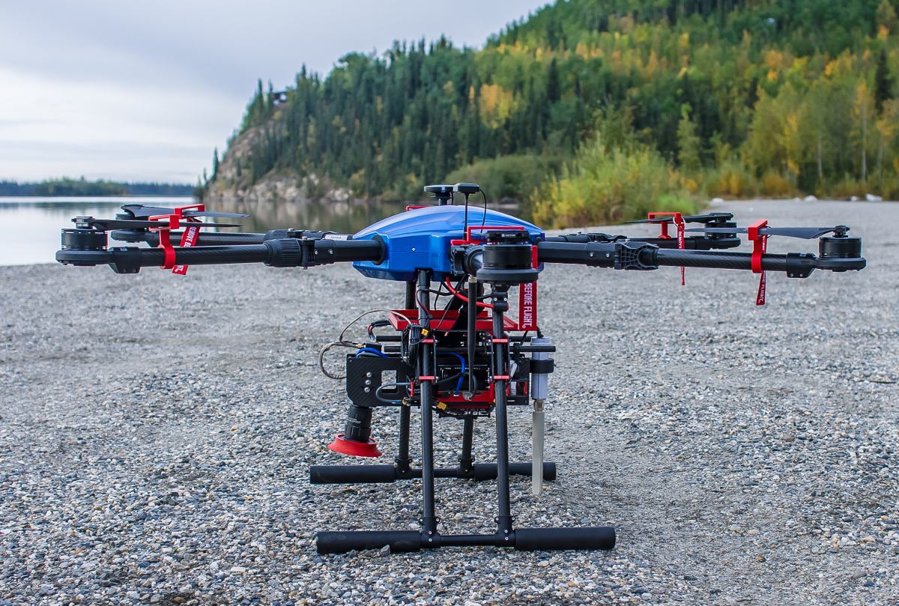

# September 2021 data collects in Alaska

[Kitware](https://www.kitware.com/url) and [ACUASI](https://acuasi.alaska.edu/) tested our payload at the [Tanana River](https://www.google.com/maps/place/64%C2%B047'47.1%22N+147%C2%B044'52.6%22W/@64.7964167,-147.75002,351m/data=!3m2!1e3!4b1!4m5!3m4!1s0x0:0x0!8m2!3d64.7964127!4d-147.7479326) and the [Chena River](https://www.google.com/maps/place/64%C2%B047'40.9%22N+147%C2%B057'10.0%22W/@64.7947066,-147.954961,370m/data=!3m2!1e3!4b1!4m5!3m4!1s0x0:0x0!8m2!3d64.7947043!4d-147.952767). These flights were focused on making sure the payload hardware and software are fully functional and support real-time deep-neural-network procession. After we analyze the data that we have collected, we will make it available for public access.

{: style="width:600px; align:left" }
{: style="width:600px; align:left" }
{: style="width:600px; align:left" }
